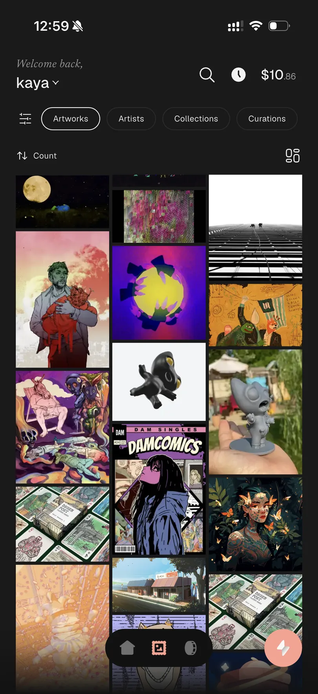

<p align="center">
  
</p>

# mallow wallet

A security-first, self-custody wallet for Solana, Ethereum, and Tezos. iOS and
Android, built with Flutter. There is no web or desktop build.

[](https://github.com/mallow-labs/mallow-wallet/actions/workflows/ci.yml)
[](LICENSE)
[](CONTRIBUTING.md)

The App Store and Google Play listings are not live yet. See
[SECURITY.md](SECURITY.md) for the official builds and how to verify one.

<p align="center">
  
</p>

<p align="center"><em>All your SOL/ETH/TEZ artworks in one place.</em></p>

---

## Security model

Each claim names what proves it; [docs/security.md](docs/security.md) has the full model.

- **Keys you create or import never leave the device.** Mnemonics and imported
  private keys go to `MnemonicVault` ([`lib/core/security/`](lib/core/security/)),
  not `flutter_secure_storage`: an iOS Keychain item marked
  `kSecAttrAccessibleWhenUnlockedThisDeviceOnly` (no iCloud, no device backup),
  and on Android a non-exportable AES-256-GCM key generated inside
  AndroidKeystore, with only ciphertext on disk. No escrow, no server-side
  backup, no code path that transmits key material.
- **Hardware wallets keep their key off the phone entirely.** A Ledger signs over
  BLE, and on Android a wallet can be backed by the device's own Seed Vault
  (Solana Mobile) — Android-only, and Solana-only, because Seed Vault defines
  exactly one signing purpose. Either way mallow stores no key and no signature
  is produced without an approval the user gives outside this app. The Seed Vault
  option only appears when the OS actually provides one, decided by a runtime
  probe rather than by the device model, which any ROM can claim.
- **Social sign-in wallets have a different custody model**
  ([`social_auth_service.dart`](lib/core/services/social_auth_service.dart)).
  Google or Apple sign-in derives the key through Web3Auth from your social
  identity, so it is reproducible off this device by whoever controls that
  identity — which is what makes "restore by logging in again" work, and is a
  real trust dependency. One secp256k1 key backs both the Ethereum and Tezos
  addresses, so the two share a fate. Create or import a wallet instead if you
  do not want that.
- **Signing is gated by app lock; per-transaction auth is opt-in and off by
  default.** The floor is the lock screen — biometric-first with a PIN fallback,
  on cold start and after 60 seconds backgrounded. `TransactionAuthGate` can
  demand a second factor per transaction, but it is off unless you enable it in
  Settings → Security & Privacy. A default install does not prompt per signature.
- **EVM transfers are simulated, and the gate fails closed.** They run through
  `eth_simulateV1`, and signing is blocked unless the only asset movement is the
  one you asked for; an unreachable simulation endpoint errors the transfer
  rather than proceeding unchecked
  (`_assertSimulation` in [`ethereum_transfer_service.dart`](lib/features/send/services/ethereum_transfer_service.dart)).
- **There is no third-party signing surface.** No WalletConnect, no Mobile Wallet
  Adapter, no in-app browser, no deep-link signing intent. The wallet signs only
  what its own flows produce, so no outside site or app can put a transaction in
  front of you. Seed Vault does not change this: it is a key store the app calls
  into, not a service the app offers — nothing outside mallow can ask it to sign
  through us.

### What this repository does not prove

- **Builds are not reproducible.** You cannot take a distributed binary and
  verify it was compiled from this source. What this repository offers is
  auditable source and a definitive list of where builds are published —
  [SECURITY.md](SECURITY.md).
- **Solana signing is not instruction-checked.** Solana flows simulate before you
  confirm, but the result is advisory — a failed simulation does not stop the
  signature. For transactions the backend builds, the client decodes, refreshes
  the blockhash, signs and broadcasts without inspecting instruction contents, so
  a hostile backend could hand you a transaction you did not intend. What limits
  that is scope, not inspection.
  → `signSendConfirm` in [`lib/core/services/transaction_signing.dart`](lib/core/services/transaction_signing.dart)
- **The debugPrint guard is structural, not a content scan.** `debugPrint` is not
  stripped from release builds, so its output reaches the platform log (logcat,
  OSLog). `tool/lint/check_sensitive_debug_print.sh` bans the call outright inside
  the key- and auth-handling paths it lists, whatever the argument, and checks
  nothing outside them.

[docs/security.md](docs/security.md) enumerates the rest under "Known gaps". Found
a vulnerability? [SECURITY.md](SECURITY.md) — please do not open a public issue.

## Getting it running

Use the Flutter SDK version pinned in [CONTRIBUTING.md](CONTRIBUTING.md) —
`dart format` output differs between releases, so another version fails the
format check on files you never touched.

```bash
flutter pub get
./di.sh                  # code generation — NOT bare build_runner
cp .env.example .env     # then read it
touch .env.local
flutter test
```

**Always run `./di.sh`, never `dart run build_runner build` at the repository
root.** Nothing generated is checked in, so codegen is required. The root's mocks
reference types from `packages/`, which must build first; root-first makes
mockito fall back to `dynamic` and produces a wall of `invalid_override` errors
that look like your fault and are not.

`flutter analyze` and `flutter test` need no configuration. Three things stand
between that and a working app on a device:

1. **A backend — `API_BASE_URL`.** The one variable with no default of any kind.
   Unset, the app starts and local wallet operations work, but every API request
   is rejected with a `StateError` naming the variable. Point it at your own
   backend implementing `packages/mallow_api/openapi/openapi.yaml`, or use a
   `MALLOW_API_KEY` with the base URL issued alongside it.

2. **Firebase config.** The `google-services` Gradle plugin fails the Android
   build outright without its config file, and `Firebase.initializeApp()` throws
   on iOS. Both real files are gitignored; the shipped placeholders boot
   immediately and every value in them is obviously fake:

   ```bash
   cp test/e2e/google-services.placeholder.json      android/app/google-services.json
   cp test/e2e/GoogleService-Info.placeholder.plist  ios/Runner/GoogleService-Info.plist
   ```

3. **A Solana RPC endpoint with DAS** — the one that fails quietly.
   `RPC_PROXY_BASE_URL` defaults to Solana's public mainnet node, which has no
   DAS extensions. Without `searchAssets`, `getAsset` and `getAssetProof` the
   portfolio and every NFT list come back empty and nothing errors.

Then `./run.sh` (any `flutter run` flag passes through) — it is `flutter run`
with `.env` and `.env.local` compiled in, which a hand-written `flutter run` is
not. [docs/backend.md](docs/backend.md) has one section per external service and
exactly what breaks when it is missing.

## Build variables

Everything the app reads is a `--dart-define`, compiled in from `.env` at build
time. ⚠️ **A `--dart-define` is not a secret** — every value is recoverable from
the compiled binary.

| Variable | Controls | Required? | Where a value comes from |
|---|---|---|---|
| `API_BASE_URL` | The backend every API call resolves against. | **Required.** No default. | Your own backend implementing `packages/mallow_api/openapi/openapi.yaml` — or `https://api.mallow.art` if you hold a `MALLOW_API_KEY`. Set the two together. |
| `MALLOW_API_KEY` | Authenticates this build against a mallow-operated backend, sent as `x-api-key` to the `API_BASE_URL` hosts only. | Optional. The short path to a running app instead of writing a backend. | Ask in the mallow [Discord](https://mallow.art/discord) or email <support@mallow.art>. |
| `RPC_PROXY_BASE_URL` | Solana JSON-RPC **and DAS**. Drives the portfolio and every NFT list. | Optional, strongly recommended. The default has no DAS. | A DAS-capable provider: [Helius](https://www.helius.dev), [Triton](https://triton.one), [QuickNode](https://www.quicknode.com). |
| `WEB3AUTH_CLIENT_ID` | Sign in with Google / Apple. | Optional. | <https://dashboard.web3auth.io>. |
| `ENV` | Cluster, explorer, Web3Auth network, rewards-store path. | Optional. Defaults to `production`. | You choose. 🛑 It is part of social key derivation — never change it for a live deployment. |

[docs/configuration.md](docs/configuration.md) documents all of them; [`.env.example`](.env.example) is the template.

## Forking

You are welcome to. Three things to know before you distribute a build:

- **You must rename and reskin.** The MIT license covers the code, not the mallow
  name, wordmark, logo, or the brand material in `assets/`. See
  [TRADEMARK.md](TRADEMARK.md).
- **A fork you distribute runs against your backend, not ours.** The contract is
  the vendored OpenAPI spec at `packages/mallow_api/openapi/openapi.yaml`,
  generated from private schemas — treat the vendored copy as the interface
  definition. See [docs/backend.md](docs/backend.md).
- **Store-delivery tooling is not in this repository.** Signing lanes and export
  options are internal; bring your own.

## Documentation

| | |
|---|---|
| [docs/configuration.md](docs/configuration.md) | Every build variable, what it controls, where a value comes from |
| [docs/backend.md](docs/backend.md) | What a fork must provide, service by service |
| [docs/security.md](docs/security.md) | Storage, signing gates, derivation paths, known gaps |
| [docs/architecture.md](docs/architecture.md) | Structure, naming, state management, the standalone packages |
| [docs/api.md](docs/api.md) | Endpoints and the `/v1` vs `/v2` split |
| [docs/workflow.md](docs/workflow.md) | CLI commands and testing |
| [docs/artwork_state.md](docs/artwork_state.md) | How an artwork's action state is derived |
| [docs/keystone.md](docs/keystone.md) | Keystone hardware-wallet QR support — a design note for work not yet built |
| [CONTRIBUTING.md](CONTRIBUTING.md) | Build steps, CI gates, DCO sign-off |
| [SECURITY.md](SECURITY.md) | Disclosure policy and how to verify a genuine build |
| [THIRD_PARTY_NOTICES.md](THIRD_PARTY_NOTICES.md) | Bundled third-party material and its licences |

## License

MIT — see [LICENSE](LICENSE). The name, logo, and brand assets are excluded; see
[TRADEMARK.md](TRADEMARK.md).
